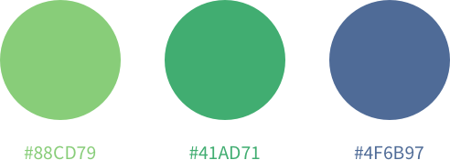

This folder contains brand assets.

# Logo

Four horizontal variations that include both the mark and the logotype. When
using the logo in contexts where it's surrounded by other elements, leave
a padding of about 10% of its height on each side.

# Icon

Four icon variations to be used on social media and other contexts where the
horizontal logo wouldn't fit.

# Colors

Primary color: `#88CD79`
Secondary color: `#41AD71`
Tertiary color: `#4F6B97`

# Type

Avenir Next, designed by Adrian Frutiger and Akira Kobayashi for Linotype.
